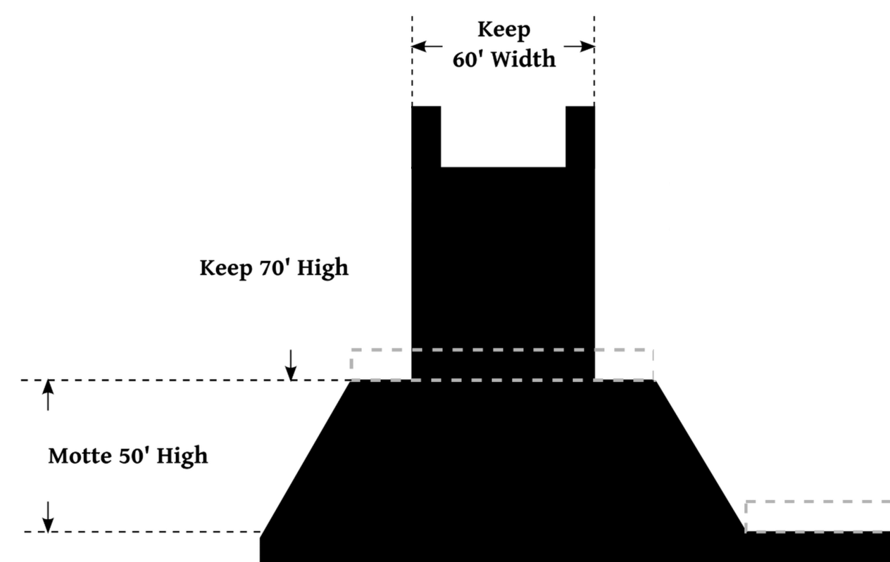

# Motte

<p align="center">
    
</p>

A motte is an artificial mound made of earth and stone upon which the castle's keep (fortified tower) was built, providing a raised, defensible position. 

Motte provides a collection of libraries (the mound) written for Kotlin MPP to build key management crypto apps (the castle's keep) with.

## Publish to local Maven

To use the Motte in local projects, currently the only way is to publish the library to the local Maven repository. For this run the following command:

```sh
./gradlew publishToMavenLocal
```

After this the library can be used in a local project as any other library:

`libs.version.toml`
```toml
[versions]
motte = "0.1.0"

[libraries]
motte = { group = "dev.rimeissner.motte", name = "shared", version.ref = "motte" }
```

`build.gradle.kts`
```kts
dependencies {
    implementation(libs.motte)
}
```

## Encryption of Signing Keys

To securely store the signing key/ mnemonic (which cannot be stored in the AndroidKeyStore) multistep encryption is utilized.

In a first step the key is encrypted using a device key. This key should be stored in the secure storage (aka strong box) of the device.

The second step is to use an app key to encrypted the encrypted data from the first encryption step.

This app key itself should be stored encrypted too. To allow different user authentication methods this key might be stored multiple times.

It is noteworthy that the encrypted signing key/ mnemonic will be stored in the App storage, which should not be considered secure. Same applies to the encrypted app keys.


### Attack Scenarios

*Encrypted signing key/ mnemonic gets leaked:*

The strong device key ensures that in this case the signing key/ mnemonic cannot be recovered. Even with a weak user authentication the signing key/ mnemonic will be secure.

*App gets compromise/ device key gets leaked:*

In this case the security depends on the user authentication. Biometric authentication on modern devices can be considered secure, as long as no physical access to the device AND biometric material is present. It is essential that a strong password is chosen to avoid a compromise in this case.

*Device gets stolen/ user authentication gets (partially compromise):*

As the other steps are protecting against data extraction it is essential that the app integrating the signing logic protects itself against brute force attacks (i.e. by applying delays). Also the previous considerations apply.

*Materialized key gets exposed in memory:*

This is something the operation system should prevent. To minimize the impact of leakage it is recommended to use multisignature approaches, where the signer is just one of multiple singers.


